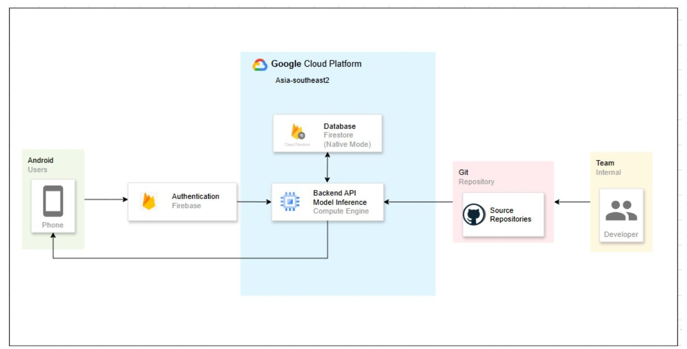

# 🥚 Egglyze: Backend Flask API  
**Egg Quality Classification System Based on Shell Analysis**  
*Bangkit Academy Capstone Project (Oct 2024 – Dec 2024)*  

---

## 🧠 Overview  
This project focuses on building a **Flask-based backend API** that serves as a **bridge between a machine learning (ML) model and a mobile application**. It enables real-time egg quality prediction based on shell analysis.  

The backend is **deployed on Google Cloud Compute Engine**, integrated with **Google Cloud Firestore** for data management, and tested using **Postman API**.

---

## ☁️ Cloud Architecture  
Below is the system architecture illustrating the cloud components:

<p align="center">
  
</p>

---

## ⚙️ Tech Stack  
- **Backend Framework:** Flask (Python)  
- **Cloud Platform:** Google Cloud Compute Engine  
- **Database:** Google Cloud Firestore  
- **API Testing:** Postman  
- **Libraries:** TensorFlow, Requests, Werkzeug  

---

## 🚀 Getting Started (Local Setup)

Follow these steps to set up and run the backend locally:  

### 1. Clone this repository  
```bash
git clone https://github.com/yourusername/egglyze-backend.git
cd egglyze-backend
```

### 2. Create a virtual environment  
```bash
python -m venv venv
```

### 3. Activate the virtual environment  
**Windows:**  
```bash
.\venv\Scripts\activate
```  
**Linux / macOS:**  
```bash
source venv/bin/activate
```

### 4. Install dependencies  
```bash
pip install flask tensorflow requests werkzeug
```

### 5. Run the backend API  
```bash
python backend_API.py
```

### 6. (Optional) Test the API  
You can test the API using:
- **Postman**, or  
- Run the provided test script:  
  ```bash
  python test_backend.py
  ```

---

## ☁️ Deploying on Google Cloud Compute Engine (GCE)

Follow these steps to deploy the Flask API on Google Cloud Compute Engine:  

### 1. Create a VM Instance  
- Go to **Google Cloud Console → Compute Engine → VM Instances**.  
- Click **“Create Instance.”**  
- Choose a machine type (e.g., `e2-medium`) and OS (e.g., Ubuntu 22.04).  
- Under **Firewall**, check:  
  ✅ “Allow HTTP traffic”  
  ✅ “Allow HTTPS traffic.”  

### 2. Connect to your instance via SSH  
```bash
gcloud compute ssh your-instance-name --zone=your-zone
```

### 3. Install Python and Git  
```bash
sudo apt update
sudo apt install python3-pip git -y
```

### 4. Clone your repository and install dependencies  
```bash
git clone https://github.com/yourusername/egglyze-backend.git
cd egglyze-backend
python3 -m venv venv
source venv/bin/activate
pip install -r requirements.txt
```

If you don’t have a `requirements.txt`, create one:  
```bash
echo "flask
tensorflow
requests
werkzeug" > requirements.txt
```

### 5. Modify Flask app to listen on all interfaces  
In `backend_API.py`, ensure you have:  
```python
if __name__ == "__main__":
    app.run(host="0.0.0.0", port=8080)
```

### 6. Run the Flask app  
```bash
nohup python3 backend_API.py &
```

Your app will now run in the background.  
Access it via:  
```
http://<your-external-ip>:8080
```

### 7. (Optional) Use Gunicorn for production  
```bash
pip install gunicorn
gunicorn -b 0.0.0.0:8080 backend_API:app
```

---

## 🧩 Notes  
- `test_backend.py` is an optional script for local API testing.  
- For production, the backend is hosted on **Google Cloud Compute Engine**, ensuring scalability and real-time performance.  

---

## 👥 Contributors  
- Team Members – Cloud Computing Cohort 
